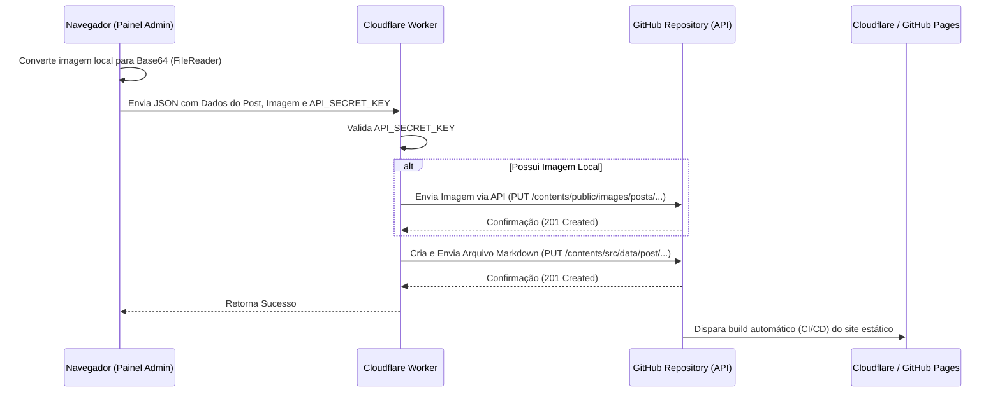

# Skill: Publicador Headless sem Banco de Dados (Astro + Cloudflare Worker + GitHub API)

Este documento descreve como implementar um painel de publicação de artigos direto no repositório GitHub para sites estáticos criados com Astro. O sistema dispensa bancos de dados, utilizando o próprio repositório como fonte da verdade (Git-based CMS) de forma segura.

---

## 🏗️ Visão Geral da Arquitetura



### Principais Benefícios:
1. **Custo Zero:** Roda totalmente nos planos gratuitos do Cloudflare e GitHub.
2. **Segurança:** O token do GitHub fica protegido como *Secret* dentro do Cloudflare Worker. O frontend só precisa enviar uma chave de segurança personalizada (`API_SECRET_KEY`).
3. **Upload Local:** Permite selecionar imagens do computador do usuário, enviá-las direto para o repositório e referenciá-las dinamicamente no Markdown.
4. **Deploy Automático:** O próprio commit gerado pela API aciona a esteira de build do site (Vercel, Netlify, Cloudflare Pages ou GitHub Actions).

---

## 🔑 Passo 1: Gerando o Token do GitHub

Para que o Cloudflare Worker possa commitar arquivos em seu repositório, você precisa gerar um token pessoal.

1. Vá em seu perfil do GitHub: **Settings** > **Developer Settings** > **Personal access tokens** > **Tokens (classic)**.
2. Clique em **Generate new token (classic)**.
3. Defina um nome descritivo (ex: `Worker Astro Publisher`).
4. Selecione a permissão principal: **`repo`** (necessária para ler e gravar commits no repositório).
5. Gere o token e **copie-o imediatamente** (você não poderá vê-lo novamente).

---

## ⚙️ Passo 2: O Backend (Cloudflare Worker)

O Worker atua como um intermediário seguro (Proxy API) entre o site e a API do GitHub.

### 1. Arquivo de Configuração (`wrangler.toml`)
Crie um projeto do Worker e defina as variáveis de ambiente públicas:

```toml
name = "meu-projeto-publisher-api"
main = "index.js"
compatibility_date = "2024-11-01"

[vars]
REPO_OWNER = "seu-usuario-github"
REPO_NAME = "nome-do-repositorio"
REPO_BRANCH = "main"
POSTS_PATH = "src/data/post" # Pasta onde ficam os markdowns dos posts
```

### 2. Adicionando as Variáveis Sensíveis (Secrets)
Execute no terminal da pasta do seu Worker para definir as chaves protegidas:
```bash
npx wrangler secret put GITHUB_TOKEN      # Insira o token gerado no Passo 1
npx wrangler secret put API_SECRET_KEY    # Crie uma senha forte de sua preferência para uso no painel
```

### 3. Código do Worker (`index.js`)
Este script lida com CORS, autenticação, upload opcional de imagens e a geração do arquivo `.md` com frontmatter estruturado.

```javascript
export default {
  async fetch(request, env, ctx) {
    // Configuração de Headers CORS
    const corsHeaders = {
      'Access-Control-Allow-Origin': '*',
      'Access-Control-Allow-Methods': 'POST, OPTIONS',
      'Access-Control-Allow-Headers': 'Content-Type, Authorization',
      'Access-Control-Max-Age': '86400',
    };

    if (request.method === 'OPTIONS') {
      return new Response(null, { headers: corsHeaders });
    }

    if (request.method !== 'POST') {
      return new Response(JSON.stringify({ error: 'Método não permitido. Utilize POST.' }), {
        status: 405,
        headers: { ...corsHeaders, 'Content-Type': 'application/json' },
      });
    }

    try {
      // Validação da Chave de Segurança
      const authHeader = request.headers.get('Authorization');
      if (!authHeader || authHeader !== `Bearer ${env.API_SECRET_KEY}`) {
        return new Response(JSON.stringify({ error: 'Acesso não autorizado. Chave inválida.' }), {
          status: 401,
          headers: { ...corsHeaders, 'Content-Type': 'application/json' },
        });
      }

      const body = await request.json();
      const { title, image, content, excerpt, category, author, imageFileContent, imageFilePath } = body;

      if (!title || !content || !excerpt) {
        return new Response(
          JSON.stringify({ error: 'Campos obrigatórios ausentes: title, content, excerpt.' }),
          { status: 400, headers: { ...corsHeaders, 'Content-Type': 'application/json' } }
        );
      }

      // 1. Upload de Imagem Local (se enviada em Base64)
      if (imageFileContent && imageFilePath) {
        const imageGithubUrl = `https://api.github.com/repos/${env.REPO_OWNER}/${env.REPO_NAME}/contents/${imageFilePath}`;
        
        const imageResponse = await fetch(imageGithubUrl, {
          method: 'PUT',
          headers: {
            'Authorization': `Bearer ${env.GITHUB_TOKEN}`,
            'Accept': 'application/vnd.github+json',
            'X-GitHub-Api-Version': '2022-11-28',
            'User-Agent': 'Cloudflare-Worker-GitHub-Publish-Astro',
            'Content-Type': 'application/json',
          },
          body: JSON.stringify({
            message: `feat(blog): upload imagem para o post "${title}" via api`,
            content: imageFileContent,
            branch: env.REPO_BRANCH || 'main'
          })
        });

        if (!imageResponse.ok) {
          const imgErrorData = await imageResponse.json();
          return new Response(
            JSON.stringify({ error: 'Erro ao fazer upload da imagem no GitHub.', details: imgErrorData.message }),
            { status: imageResponse.status, headers: { ...corsHeaders, 'Content-Type': 'application/json' } }
          );
        }
      }

      // 2. Geração do Slug e Caminho do Arquivo Markdown
      const slug = slugify(title);
      const fileName = `${slug}.md`;
      const folderPath = env.POSTS_PATH || 'src/data/post'; 
      const fullPath = `${folderPath}/${fileName}`;

      // Data formatada no timezone de Brasília
      const publishDate = getBrazilISODate();

      // 3. Montagem do Arquivo Markdown com Frontmatter
      const markdownContent = `---
title: "${title.replace(/"/g, '\\"')}"
publishDate: ${publishDate}
${category ? `category: "${category}"` : ''}
excerpt: "${excerpt.replace(/"/g, '\\"')}"
draft: false
${image ? `image: "${image}"` : ''}
${author ? `author: "${author}"` : ''}
metadata:
  title: "${title.replace(/"/g, '\\"')}"
  description: "${excerpt.replace(/"/g, '\\"')}"
---

${content}
`;

      const base64Content = utf8ToBase64(markdownContent);
      const githubUrl = `https://api.github.com/repos/${env.REPO_OWNER}/${env.REPO_NAME}/contents/${fullPath}`;
      
      const githubResponse = await fetch(githubUrl, {
        method: 'PUT',
        headers: {
          'Authorization': `Bearer ${env.GITHUB_TOKEN}`,
          'Accept': 'application/vnd.github+json',
          'X-GitHub-Api-Version': '2022-11-28',
          'User-Agent': 'Cloudflare-Worker-GitHub-Publish-Astro',
          'Content-Type': 'application/json',
        },
        body: JSON.stringify({
          message: `feat(blog): publicar artigo "${title}" via api`,
          content: base64Content,
          branch: env.REPO_BRANCH || 'main'
        })
      });

      if (githubResponse.status === 201) {
        return new Response(
          JSON.stringify({ 
            success: true, 
            message: 'Artigo publicado com sucesso!', 
            slug: slug,
            path: fullPath 
          }),
          { status: 201, headers: { ...corsHeaders, 'Content-Type': 'application/json' } }
        );
      } else if (githubResponse.status === 422) {
        return new Response(
          JSON.stringify({ error: 'Um artigo com este mesmo título/slug já existe.' }),
          { status: 409, headers: { ...corsHeaders, 'Content-Type': 'application/json' } }
        );
      } else {
        const errorData = await githubResponse.json();
        return new Response(
          JSON.stringify({ error: 'Erro ao salvar o markdown no GitHub.', details: errorData.message }),
          { status: githubResponse.status, headers: { ...corsHeaders, 'Content-Type': 'application/json' } }
        );
      }

    } catch (err) {
      return new Response(JSON.stringify({ error: 'Erro interno no servidor.', details: err.message }), {
        status: 500,
        headers: { ...corsHeaders, 'Content-Type': 'application/json' },
      });
    }
  }
};

// Funções Utilitárias do Worker
function slugify(text) {
  return text
    .toString()
    .normalize('NFD')
    .replace(/[\u0300-\u036f]/g, '')
    .toLowerCase()
    .trim()
    .replace(/\s+/g, '-')
    .replace(/[^\w-]+/g, '')
    .replace(/--+/g, '-');
}

function getBrazilISODate() {
  const now = new Date();
  const utc = now.getTime() + (now.getTimezoneOffset() * 60000);
  const brazilTime = new Date(utc + (3600000 * -3));
  
  const yyyy = brazilTime.getFullYear();
  const mm = String(brazilTime.getMonth() + 1).padStart(2, '0');
  const dd = String(brazilTime.getDate()).padStart(2, '0');
  const hh = String(brazilTime.getHours()).padStart(2, '0');
  const min = String(brazilTime.getMinutes()).padStart(2, '0');
  const ss = String(brazilTime.getSeconds()).padStart(2, '0');
  
  return `${yyyy}-${mm}-${dd}T${hh}:${min}:${ss}-03:00`;
}

function utf8ToBase64(str) {
  return btoa(encodeURIComponent(str).replace(/%([0-9A-F]{2})/g, function(match, p1) {
    return String.fromCharCode(parseInt(p1, 16));
  }));
}
```

---

## 🖥️ Passo 3: O Frontend (Página no Astro)

Crie a página de formulário administrativo (ex: `src/pages/admin/publicar.astro`). Certifique-se de configurar a tag `robots: { index: false, follow: false }` no cabeçalho do Astro para evitar indexação pública da URL por buscadores de SEO.

### Estrutura Base do Formulário
Insira campos de entrada para Título, Categoria (opcional), Autor (opcional), Caminho da Imagem, Descrição Excerpt (SEO/Card) e Conteúdo. Adicione um campo `<input type="file" id="imageFileInput" class="hidden" accept="image/*" />` e um botão/label para acionar a navegação de arquivos no computador do usuário.

### 💡 Script no Frontend com Boas Práticas (TypeScript)

No Astro, scripts client-side rodam em escopo próprio. É fundamental garantir a correta tipagem do DOM para passar sem erros no `astro check` e lints de TypeScript.

> [!IMPORTANT]
> **TypeScript Casting:** Sempre faça cast explícito de elementos selecionados via `document.getElementById` usando `as HTMLInputElement`, `as HTMLTextAreaElement`, etc. Caso contrário, o build falhará ao checar propriedades específicas como `.value` ou `.files`.

```html
<script>
  const WORKER_URL = 'SUA_URL_DA_API_AQUI'; // URL do Cloudflare Worker

  // Casts explícitos para o compilador TypeScript
  const form = document.getElementById('publishForm') as HTMLFormElement | null;
  const submitBtn = document.getElementById('submitBtn') as HTMLButtonElement | null;
  const statusMessage = document.getElementById('statusMessage') as HTMLDivElement | null;
  const apiSecretInput = document.getElementById('apiSecret') as HTMLInputElement | null;
  const imageInput = document.getElementById('image') as HTMLInputElement | null;
  const imageFileInput = document.getElementById('imageFileInput') as HTMLInputElement | null;

  let selectedFileBase64: string | null = null;
  let selectedFileName: string | null = null;

  // Verificação de nulidade (Essencial para passar no 'astro check')
  if (!form || !submitBtn || !statusMessage || !apiSecretInput || !imageInput || !imageFileInput) {
    console.error("Erro: Elementos obrigatórios ausentes no HTML.");
    throw new Error("Elementos ausentes.");
  }

  // 1. Escuta upload de arquivo de imagem do computador local
  imageFileInput.addEventListener('change', (e) => {
    const target = e.target as HTMLInputElement | null;
    const file = target?.files?.[0];
    if (!file) return;

    // Normaliza o nome do arquivo da imagem local
    const extension = file.name.split('.').pop() || 'jpg';
    const cleanName = file.name
      .replace(`.${extension}`, '')
      .normalize('NFD')
      .replace(/[\u0300-\u036f]/g, '')
      .toLowerCase()
      .replace(/[^a-z0-9]+/g, '-')
      .replace(/(^-|-$)+/g, '');
    
    // Adiciona um timestamp para evitar colisões de imagens com mesmo nome
    const timestamp = Math.floor(Date.now() / 1000) % 100000;
    selectedFileName = `${cleanName}-${timestamp}.${extension}`;
    
    // Atualiza o input de texto do formulário para mostrar onde a imagem ficará salva
    imageInput.value = `/images/posts/${selectedFileName}`;

    // Converte a imagem local para Base64 usando FileReader
    const reader = new FileReader();
    reader.onload = () => {
      if (typeof reader.result === 'string') {
        // Separa o prefixo 'data:image/...;base64,' e armazena apenas o conteúdo binário puro
        selectedFileBase64 = reader.result.split(',')[1];
      }
    };
    reader.readAsDataURL(file);
  });

  // 2. Persistência de Chave de Segurança no Navegador
  const storedApiSecret = localStorage.getItem('aw_api_secret');
  if (storedApiSecret) {
    apiSecretInput.value = storedApiSecret;
  }

  // 3. Envio do Formulário
  form.addEventListener('submit', async (e) => {
    e.preventDefault();

    submitBtn.disabled = true;
    submitBtn.innerText = 'Publicando...';

    const apiSecret = apiSecretInput.value.trim();
    localStorage.setItem('aw_api_secret', apiSecret); // Salva para a próxima sessão do admin

    // Seleciona os inputs de dados de post
    const titleEl = document.getElementById('title') as HTMLInputElement | null;
    const categoryEl = document.getElementById('category') as HTMLSelectElement | null;
    const authorEl = document.getElementById('author') as HTMLInputElement | null;
    const excerptEl = document.getElementById('excerpt') as HTMLTextAreaElement | null;
    const contentEl = document.getElementById('content') as HTMLTextAreaElement | null;

    const payload = {
      title: titleEl?.value || '',
      category: categoryEl?.value || '',
      author: authorEl?.value || '',
      image: imageInput.value || '',
      excerpt: excerptEl?.value || '',
      content: contentEl?.value || '',
      imageFileContent: selectedFileBase64,
      imageFilePath: selectedFileBase64 ? `public/images/posts/${selectedFileName}` : null
    };

    try {
      const response = await fetch(WORKER_URL, {
        method: 'POST',
        headers: {
          'Content-Type': 'application/json',
          'Authorization': `Bearer ${apiSecret}`
        },
        body: JSON.stringify(payload)
      });

      const result = await response.json();

      if (response.ok) {
        statusMessage.innerHTML = `<strong>🎉 Publicado com Sucesso!</strong> O artigo e a imagem foram commitados e o site atualizará em breve.`;
        statusMessage.className = 'status-success'; // Adicione sua estilização de sucesso aqui
        
        // Reseta o formulário mantendo apenas a senha de segurança
        form.reset();
        selectedFileBase64 = null;
        selectedFileName = null;
      } else {
        statusMessage.innerHTML = `<strong>⚠️ Erro (${response.status}):</strong> ${result.error || 'Erro inesperado.'}`;
        statusMessage.className = 'status-error';
      }
    } catch (error) {
      const err = error as Error;
      statusMessage.innerHTML = `<strong>🔌 Erro de Conexão:</strong> Não foi possível acessar a API.<br>${err.message}`;
      statusMessage.className = 'status-warning';
    } finally {
      submitBtn.disabled = false;
      submitBtn.innerText = 'Publicar Artigo';
    }
  });
</script>
```

---

## 💡 Lições Aprendidas e Dicas de Ouro

* **Tratamento de Strings no Markdown:** O título e o resumo (*excerpt*) vão direto para o frontmatter do arquivo markdown. Lembre-se de escapar as aspas duplas (`.replace(/"/g, '\\"')`) no Worker para não corromper o cabeçalho YAML dos artigos.
* **CORS (Cross-Origin Resource Sharing):** Certifique-se de configurar o Worker para lidar com preflight requests (`OPTIONS`). Sem o header de resposta apropriado, qualquer navegador vai barrar o POST vindo do frontend do site.
* **Segurança e SEO:** Por ser um formulário sensível de escrita, adicione metatags do Astro informando aos buscadores de busca para nunca indexar a URL administrativa: `<meta name="robots" content="noindex, nofollow" />`.
* **Caminho de Imagem:** Salve a imagem dentro de `public/images/posts/` (para Astro clássico) para que ela seja servida de forma estática sem precisar processar o import e sem depender de banco de dados externo como S3.
* **Impedindo Commits Inválidos:** O Worker gera um timestamp no nome do arquivo de upload local (ex: `imagem-12345.jpg`) garantindo nomes únicos e prevenindo que uploads com nomes genéricos como `imagem.jpg` sobrescrevam fotos de posts antigos.
